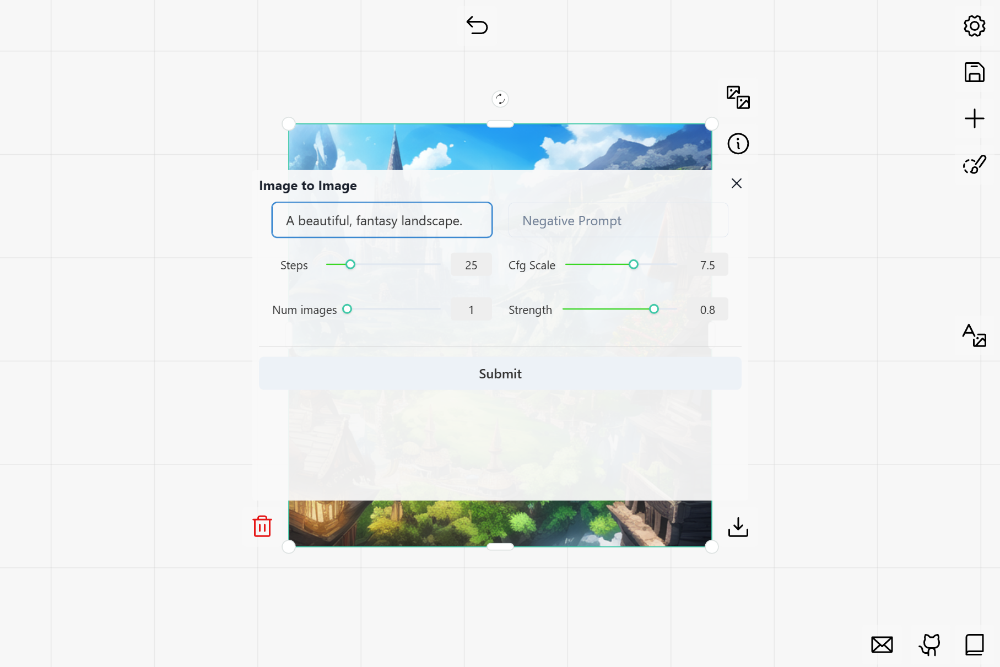

# carefree-drawboard 🎨



> This is the screenshot I used for the [Stable Diffusion](https://github.com/carefree0910/carefree-drawboard/tree/dev/examples/stable_diffusion) example and I don't know what should be the proper banner, help!

<div align="center">

### [Wiki](https://github.com/carefree0910/carefree-drawboard/wiki) | [Examples](https://github.com/carefree0910/carefree-drawboard/tree/dev/examples) | [Stable Diffusion](https://github.com/carefree0910/carefree-drawboard/tree/dev/examples/stable_diffusion)

<div align="left">

## Installation

`carefree-drawboard` 🎨 requires the following to get started:

* Python 3.8+
* [Node.js 12.22.0+](https://nodejs.org/en/)

```bash
pip install carefree-drawboard
npm install --global yarn
```

## Your first `carefree-drawboard` 🎨 App

Create a folder (e.g., `my_fancy_app`) wherever you like, get into it, and run

```bash
cfdraw init
```

> When you run this command for the first time, we will use `yarn` to install the JavaScript dependencies for you, which may be quite slow!

This command will write two files to your folder (`my_fancy_app`). After which you can run the app in development mode:

```bash
cfdraw run
```

And you should see your app running at http://localhost:5123. Now you can play with the generated `app.py` file and see warm reload (yeah, not hot enough because we rely on the `reload` provided by `uvicorn` 🤣).

> Notice that the generated template implements a Gaussian Blur plugin, which requires an image to pop up. You can upload an image either by dropping on directly to the drawboard 🎨, or by clicking the `Plus` button at the top right corner and select `Upload Image`.

## Examples

* [Getting Started](https://github.com/carefree0910/carefree-drawboard/wiki/Getting-Started), which is a more detailed tutorial to guide you step by step.
* [Image Processing](https://github.com/carefree0910/carefree-drawboard/tree/dev/examples/image_processing), which implements three common image processing plugins with `carefree-drawboard` 🎨.
* [Stable Diffusion](https://github.com/carefree0910/carefree-drawboard/tree/dev/examples/stable_diffusion), which utilizes the famous `diffusers` library and implements two common Stable Diffusion plugins with `carefree-drawboard` 🎨.
* [Caption & Diffusion](https://github.com/carefree0910/carefree-drawboard/tree/dev/examples/caption_and_diffusion), which shows how can we combine two different kinds of models (`Image Captioning` & `Stable Diffusion`) and make them work together.

## Documentation

Check the [Wiki](https://github.com/carefree0910/carefree-drawboard/wiki) page for documentation!

## Status

`carefree-drawboard` 🎨 is at a VERY early stage. It is launched in April 2023, and is not production ready (yet).

But we will rapidly update this project and launch new features every week (or, even everyday), so ⭐ star and 👀 watch this repository to stay up to date!

## Contributing

Contributions are truly welcomed! Here are some good (common) ways to get started:

* **GitHub Discussions**: Currently the best way to chat around.
* **GitHub Issues**: Bugs! Fixes! PRs!.

Apart from these:
* If you are truly an enthusiast, you may check out our [Roadmap](https://github.com/carefree0910/carefree-drawboard/wiki/Roadmap), pick up what you are interested, and create the corresponding PR!
* If you are familiar with `React`, you may check out the [Customizations](https://github.com/carefree0910/carefree-drawboard/wiki/Customizations) documentation and try to customize your own plugins and have fun!

> It is also recommended to start from the [Development Guide](https://github.com/carefree0910/carefree-drawboard/wiki/Development-Guide)!

## Q&A

### Where are my creations stored?

They are stored on your local machine, so you're 100% privacy secured!

> The default dir is `~/.cache/carefree-draw`, but you can change it manually 

### Why Using 🎨 All Around?

Good question, so I asked GPT-4, it said:

> 🎨 (Artist Palette) - This emoji represents creativity, design, and artistic expression, which are all key aspects of the `carefree-drawboard` 🎨 platform.

Cool!

### Will there be a Discord Community?

Unfortunately I'm Chinese and I can hardly access to Discord. 🤣 Even if there are someone kindly enough to build one up for me, I can hardly connect to it so it will be impossible for me to stay tuned.

If you are kind enough please use the **GitHub Discussions**, or maybe there are other Discord replacements? I don't know, help!!!

### Why do you build this project?

In short, I believe that:
* Infinite Drawboard can unleash Infinite possibilities.
* If we can use `Python` to interact with it and even craft new plugins for it, it will be even better.

So here comes the `carefree-drawboard` 🎨, which is a `Python` interactible/customizable Infinite Drawboard. 🎉

My another motivation is that I love HuggingFace 🤗 models, and would love to use most if not all of them in one, single, integrated space. This actually inspires me the following idea: to build an 'AI Operation System' which can drive all the 'Softwares' (the AI models) and make them work together seamlessly.

> See [Brainstorm 🧠](https://github.com/carefree0910/carefree-drawboard/wiki/Brainstorm-%F0%9F%A7%A0) for more details!

My final goal is to make `carefree-drawboard` 🎨 a platform which can be used to build all kinds of AI applications. I know it will be a long journey but it is definitely worth trying.

> And the middle-term goal is to make 🤗 & 🎨 appear together more often. We may think 🤗🎨 as HuggingFace models using a powerful palette to create the world (with AI)!

## Credits

- [pynecone](https://github.com/pynecone-io/pynecone), which inspires me a lot.
- [Stable Diffusion](https://github.com/CompVis/stable-diffusion), the foundation of various image generation methods.
- [Diffusers](https://github.com/huggingface/diffusers), the adopted library for the [Stable Diffusion](https://github.com/carefree0910/carefree-drawboard/tree/dev/examples/stable_diffusion) example.
- And You! Thank you for watching!
